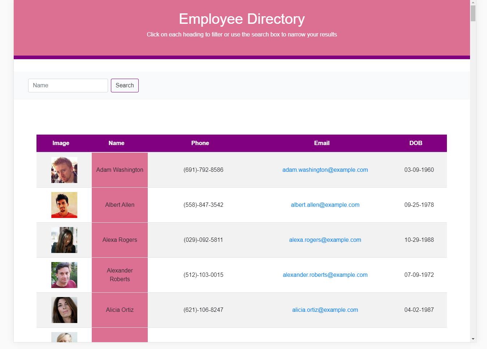

# react-employee-directory

## Overview

For this assignment, I had to create an employee directory with React. This assignment will require to break up our application's UI into components, manage component state, and respond to user events.

## Demo:

## User Story

 *	As a user, I want to be able to view my entire employee directory at once so that I have quick access to their information.
## Business Context

An employee or manager would benefit greatly from being able to view non-sensitive data about other employees. It would be particularly helpful to be able to filter employees by name.

## Features

Given a table of random users, when the user loads the page, a table of employees should render.
The user will be able to:
 * Sort the table by the First Name
 * Filter the users by First Name.
 
 ## Live Site:
 
 https://nunetang-react-employee.herokuapp.com/
